```r
library(dplyr)
library(tidyr)
library(purrr)
library(CDVine)
library(VineCopula)
library(xts)
library(tiger)
library(ggplot2)
```


```r
setRowNames <- function(df, names) {
  rownames(df) = as.POSIXct(names, format = '%Y-%m-%d')
  return(df)
}
```


```r
deleteComp <- function(df, num) {
  for (i in 2:num) {
    min_row = nrow(df)
    del_col = 0
    for (j in 2:ncol(df)) {
      new_df = df[, -j]
      this_row = new_df %>% na.omit %>% nrow
      if (this_row < min_row) {
        del_col = j
        min_row = this_row
      }
    }
    df = df[, -del_col]
  }
  return(df)
}
```

## Load data

```r
labels <- c('1', '2', '3', '4', '5')
dat <- map(labels, (function(x)
  paste('../result/rating_class_', x, '.csv', sep = ''))) %>% map(read.csv) %>% setNames(labels)
dateList = map(dat,  ~ .$Date)
#dat = map2(.x = dat, .y = c(0, 0, 0, 0, 0),  ~ deleteComp(.x, .y))
classwide_mean <- map(
  dat,
  ~ dplyr::select(., -Date) %>% fill(., everything(), .direction = 'down') %>% transmute(., mean = rowMeans(.[, 1:ncol(.)], na.rm = TRUE))
) %>% map2(.x = ., .y = dateList,  ~ setRowNames(.x, .y))
classwide_mean_diff <- map(classwide_mean,  ~ as.xts(.)%>%diff(.)%>%as.data.frame(.))
```

## Filter time period

```r
classwide_mean <- classwide_mean %>% map(.,  ~ as.xts(.) %>% .['2006/2018'] %>%
                                          as.data.frame)
classwide_mean_diff <- classwide_mean_diff %>% map(.,  ~ as.xts(.) %>% .['2006/2018'] %>%
                                                    as.data.frame)
dateList_Filtered <- classwide_mean %>% map(., rownames)
```

## calculate monthly mean pd

```r
classwide_month_mean <- classwide_mean %>% map(.,  ~ dplyr::select(., everything())) %>%
  map2(
    .x = .,
    .y = dateList_Filtered,
    ~ mutate(.x, year_month = format(as.Date(.y), "%Y-%m-%d")) %>% group_by(year_month) %>%
      summarise_at(vars(mean), list(`mean` = mean))
  )
classwide_month_mean_diff <- classwide_mean_diff %>% map(.,  ~ dplyr::select(., everything())) %>%
  map2(
    .x = .,
    .y = dateList_Filtered,
    ~ mutate(.x, year_month = format(as.Date(.y), "%Y-%m-%d")) %>% group_by(year_month) %>%
      summarise_at(vars(mean), list(`mean` = mean))
  )
```


```r
classwide_mean_df <- classwide_month_mean %>% map(.,~.$mean) %>% (function(x)
  do.call(cbind, x)) %>% na.omit
classwide_mean_diff_df <- classwide_month_mean_diff %>% map(.,~.$mean) %>% (function(x)
  do.call(cbind, x)) %>% na.omit
colnames(classwide_mean_df) <- 1:5
colnames(classwide_mean_diff_df) <- 1:5
```

## statistics of mean/different mean

```r
summary(classwide_mean_df)
```

```
##        1                  2                 3                 4                5         
##  Min.   :0.003834   Min.   :0.02014   Min.   :0.07124   Min.   :0.1135   Min.   :0.6433  
##  1st Qu.:0.008655   1st Qu.:0.05342   1st Qu.:0.14168   1st Qu.:0.1917   1st Qu.:0.9192  
##  Median :0.024857   Median :0.07722   Median :0.18739   Median :0.2446   Median :1.0662  
##  Mean   :0.061397   Mean   :0.12664   Mean   :0.25384   Mean   :0.3143   Mean   :1.1416  
##  3rd Qu.:0.077663   3rd Qu.:0.13908   3rd Qu.:0.29656   3rd Qu.:0.3379   3rd Qu.:1.2942  
##  Max.   :0.523409   Max.   :0.69544   Max.   :1.40445   Max.   :1.7618   Max.   :2.2415
```

```r
summary(classwide_mean_diff_df)
```

```
##        1                    2                    3                    4                    5             
##  Min.   :-7.644e-02   Min.   :-2.178e-01   Min.   :-1.572e-01   Min.   :-1.629e-01   Min.   :-0.2834059  
##  1st Qu.:-1.316e-04   1st Qu.:-4.079e-04   1st Qu.:-1.519e-03   1st Qu.:-2.030e-03   1st Qu.:-0.0060282  
##  Median : 0.000e+00   Median : 0.000e+00   Median : 0.000e+00   Median : 0.000e+00   Median : 0.0000000  
##  Mean   :-4.730e-06   Mean   :-7.620e-06   Mean   :-1.206e-05   Mean   : 7.627e-05   Mean   : 0.0002533  
##  3rd Qu.: 1.475e-04   3rd Qu.: 4.998e-04   3rd Qu.: 1.323e-03   3rd Qu.: 1.913e-03   3rd Qu.: 0.0061632  
##  Max.   : 7.200e-02   Max.   : 8.037e-02   Max.   : 1.677e-01   Max.   : 2.642e-01   Max.   : 0.4307921
```

## plotting

```r
meanDate <- classwide_month_mean[[1]]$year_month
plot_dat <- classwide_mean_df %>% as.data.frame %>% dplyr::select(., everything()) %>%
  mutate(., year_month = meanDate) %>% pivot_longer(.,-year_month, names_to = 'category', values_to = 'pd')
ggplot(plot_dat, aes(year_month, pd, group = category, colour = category)) +
  geom_line() + scale_x_discrete(breaks = meanDate[seq(1, length(meanDate), length(meanDate) %/% 8)])
```

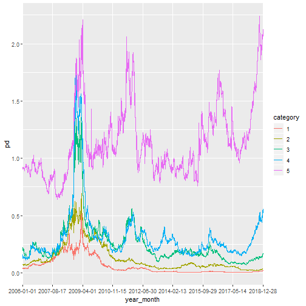

## Kendall's tau correlation

```r
cor(classwide_mean_df, method = 'kendall', use = 'pairwise')
```

```
##             1           2          3         4           5
## 1  1.00000000  0.61178142 0.54796291 0.3820836 -0.06633033
## 2  0.61178142  1.00000000 0.64427213 0.2312177 -0.04013826
## 3  0.54796291  0.64427213 1.00000000 0.4502457  0.08566166
## 4  0.38208359  0.23121769 0.45024573 1.0000000  0.33246661
## 5 -0.06633033 -0.04013826 0.08566166 0.3324666  1.00000000
```

```r
cor(classwide_mean_diff_df, method = 'kendall', use = 'pairwise')
```

```
##            1          2          3          4          5
## 1 1.00000000 0.24313192 0.25053689 0.17180837 0.09231272
## 2 0.24313192 1.00000000 0.26000603 0.24665849 0.07337269
## 3 0.25053689 0.26000603 1.00000000 0.34716564 0.09924579
## 4 0.17180837 0.24665849 0.34716564 1.00000000 0.09135492
## 5 0.09231272 0.07337269 0.09924579 0.09135492 1.00000000
```

## Plot excedence level

```r
cal_corr <- function(subq1, subq2) {
  colnames(subq1) <- c('date', 'cat1')
  colnames(subq2) <- c('date', 'cat2')
  mergeq1q2 <- merge(subq1, subq2, all = F)
  if (dim(mergeq1q2)[1] == 0) {
    result = 0
  } else
  {
    result = cor(mergeq1q2$cat1, mergeq1q2$cat2)
  }
  return(result)
}
excedenceLevel <- function(category1, category2) {
  result <- as.numeric()
  for (q in seq(0.1, 0.9, 0.1)) {
    if (q < 0.5) {
      subq1 <- category1 %>% .[.$mean < quantile(.$mean, q), ]
      subq2 <- category2 %>% .[.$mean < quantile(.$mean, q), ]
      result <- c(result, cal_corr(subq1, subq2))
    }
    else if (q > 0.5) {
      subq1 <- category1 %>% .[.$mean > quantile(.$mean, q), ]
      subq2 <- category2 %>% .[.$mean > quantile(.$mean, q), ]
      result <- c(result, cal_corr(subq1, subq2))
    }
    else{
      subq1 <- category1 %>% .[.$mean < quantile(.$mean, q), ]
      subq2 <- category2 %>% .[.$mean < quantile(.$mean, q), ]
      result <- c(result, cal_corr(subq1, subq2))
      subq3 <- category1 %>% .[.$mean > quantile(.$mean, q), ]
      subq4 <- category2 %>% .[.$mean > quantile(.$mean, q), ]
      result <- c(result, cal_corr(subq3, subq4))
    }
  }
  return(result)
}

excedence_level <- list()
name_list <- list()
for (i in 1:4) {
  for (j in i:5) {
    if (i != j) {
      excedence_level <-
        c(excedence_level, list(excedenceLevel(classwide_month_mean[[i]], classwide_month_mean[[j]])))
      name_list <-
        c(name_list, list(paste('Category ', i, '&', j, sep = '')))
    }
  }
}
excedence_level <- as.data.frame(do.call(cbind, excedence_level))
colnames(excedence_level) <- name_list
```


```r
excedence_level %>% cbind(., data.frame(level = c(seq(0.1, 0.5, 0.1), seq(0.5, 0.9, 0.1)))) %>%
  pivot_longer(.,-level, names_to = 'category', values_to = 'corr') %>% ggplot(., aes(x = level, y = corr), colour =
                                                                                 category) + ylim(NA, 1) + geom_line(linetype = 'dashed', color = 'blue') + facet_wrap('category', ncol = 3) +
  ggtitle('Correlation of Excedence Levels Between Each Pairs') + xlab('excedence level') +
  ylab('correlation')
```

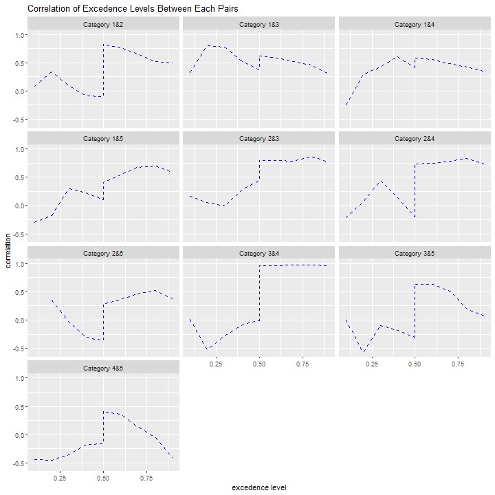
## Excedence table

```r
getExcedenceTable <- function(category1, category2) {
  levels_low <- c(0.1, 0.2, 0.3)
  levels_high <- c(0.7, 0.8, 0.9)
  result = as.numeric()
  for (q in levels_low) {
    subq2 <- category2 %>% .[.$mean < quantile(.$mean, q),]
    result <- c(result, cal_corr(category1, subq2))
  }
  for (q in levels_high) {
    subq2 <- category2 %>% .[.$mean > quantile(.$mean, q),]
    result <- c(result, cal_corr(category1, subq2))
  }
  return(result)
}

excedence_table <- list()
category_name <- list()
for (i in (1:4)) {
  for (j in (2:5)) {
    if (i != j) {
      excedence_table <-
        c(excedence_table, list(getExcedenceTable(classwide_month_mean[[i]], classwide_month_mean[[j]])))
      excedence_diff_table <-
        c(excedence_table, list(getExcedenceTable(classwide_month_mean_diff[[i]], classwide_month_mean_diff[[j]])))
      category_name <- c(category_name, list(as.character(c(i, j))))
    }
  }
}
excedence_table <-
  cbind(as.data.frame(do.call(rbind, category_name)), as.data.frame(do.call(rbind, excedence_table)))
excedence_diff_table <-
  cbind(as.data.frame(do.call(rbind, category_name)), as.data.frame(do.call(rbind, excedence_diff_table)))
```

```
## Error in data.frame(..., check.names = FALSE): arguments imply differing number of rows: 13, 14
```

```r
colnames(excedence_table) <-
  c('category', 'category', '10%', '20%', '30%', '70%', '80%', '90%')
colnames(excedence_diff_table) <-
  c('category', 'category', '10%', '20%', '30%', '70%', '80%', '90%')
```

```
## Error in `colnames<-`(`*tmp*`, value = c("category", "category", "10%", : attempt to set 'colnames' on an object with less than two dimensions
```

```r
excedence_table
```

```
##    category category         10%         20%          30%       70%       80%         90%
## 1         1        2  0.38756910  0.25395809 -0.065127709 0.7591200 0.6492962  0.49816992
## 2         1        3  0.72725903  0.48385208  0.428193229 0.5721049 0.4797410  0.54350164
## 3         1        4 -0.19098167 -0.11491212 -0.017204141 0.6079410 0.6397778  0.50804316
## 4         1        5 -0.59918743 -0.58346631 -0.600343020 0.3452283 0.2444541  0.06116699
## 5         2        3  0.39506413  0.25105935  0.345154958 0.7409300 0.7077642  0.73032009
## 6         2        4 -0.03621680 -0.05419844  0.093530924 0.7173271 0.7423931  0.69544239
## 7         2        5 -0.45961997 -0.41626282 -0.414747581 0.2570356 0.1392246 -0.05385508
## 8         3        2  0.14781896  0.65085124  0.296969187 0.8360878 0.8814869  0.85905414
## 9         3        4 -0.05777178 -0.16641260  0.019609627 0.9153943 0.9216201  0.94040515
## 10        3        5 -0.12319018 -0.11618453 -0.116988980 0.3480654 0.1933739 -0.09637693
## 11        4        2  0.04799849 -0.13803402 -0.410515851 0.8243070 0.8528456  0.79466306
## 12        4        3  0.66263871  0.54740887  0.376003209 0.9699474 0.9731368  0.96824557
## 13        4        5 -0.12271042 -0.12206483  0.004488933 0.4687825 0.3067568  0.04679070
```

```r
excedence_diff_table
```

```
## [[1]]
## [1]  0.38756910  0.25395809 -0.06512771  0.75912003  0.64929616  0.49816992
## 
## [[2]]
## [1] 0.7272590 0.4838521 0.4281932 0.5721049 0.4797410 0.5435016
## 
## [[3]]
## [1] -0.19098167 -0.11491212 -0.01720414  0.60794103  0.63977781  0.50804316
## 
## [[4]]
## [1] -0.59918743 -0.58346631 -0.60034302  0.34522833  0.24445408  0.06116699
## 
## [[5]]
## [1] 0.3950641 0.2510594 0.3451550 0.7409300 0.7077642 0.7303201
## 
## [[6]]
## [1] -0.03621680 -0.05419844  0.09353092  0.71732710  0.74239313  0.69544239
## 
## [[7]]
## [1] -0.45961997 -0.41626282 -0.41474758  0.25703560  0.13922463 -0.05385508
## 
## [[8]]
## [1] 0.1478190 0.6508512 0.2969692 0.8360878 0.8814869 0.8590541
## 
## [[9]]
## [1] -0.05777178 -0.16641260  0.01960963  0.91539433  0.92162007  0.94040515
## 
## [[10]]
## [1] -0.12319018 -0.11618453 -0.11698898  0.34806543  0.19337386 -0.09637693
## 
## [[11]]
## [1]  0.04799849 -0.13803402 -0.41051585  0.82430696  0.85284563  0.79466306
## 
## [[12]]
## [1] 0.6626387 0.5474089 0.3760032 0.9699474 0.9731368 0.9682456
## 
## [[13]]
## [1] -0.122710422 -0.122064834  0.004488933  0.468782500  0.306756762  0.046790699
## 
## [[14]]
## [1] 0.16136895 0.15787269 0.17321790 0.14805814 0.13939422 0.09096208
```

## Normalize the data to uniform distribution

```r
classwide_mean_unif_df <- classwide_mean %>% map(.,
                                                ~ transmute(., unif_mean = to.uniform(mean)) %>% dplyr::select(unif_mean)) %>%
  map2(.x = ., .y = dateList_Filtered,  ~ setRowNames(.x, .y)) %>% (function(x)
    do.call(cbind, x)) %>% na.omit
colnames(classwide_mean_unif_df) = 1:5
```


## Vine Tree Construction and Regression

```r
order <- c(2, 1, 3, 4, 5)
Gau_family <- rep(1, 10)
Cla_family <- rep(3, 10)
Gu_family <- rep(4, 10)
t_family <- rep(2, 10)
dMatrix_Gau <-
  D2RVine(order, family = Gau_family, par = rep(0.1, 10))
dMatrix_Cla <-
  D2RVine(order, family = Cla_family, par = rep(0.1, 10))
dMatrix_Gu <- D2RVine(order, family = Gu_family, par = rep(1, 10))
dMatrix_t <-
  D2RVine(order,
          family = t_family,
          par = rep(0.1, 10),
          par2 = rep(3, 10))
dMatrixGau <-
  RVineMatrix(dMatrix_Gau$Matrix, dMatrix_Gau$family, par = array(0.01, dim =
                                                                    c(5, 5)))
dMatrixCla <-
  RVineMatrix(dMatrix_Cla$Matrix, dMatrix_Cla$family, par = array(0.01, dim =
                                                                    c(5, 5)))
dMatrixGu <-
  RVineMatrix(dMatrix_Gu$Matrix, dMatrix_Gu$family, par = array(1, dim = c(5, 5)))
dMatrixt <-
  RVineMatrix(
    dMatrix_t$Matrix,
    dMatrix_t$family,
    par = array(0.01, dim = c(5, 5)),
    par2 = array(3, dim = c(5, 5))
  )
#L-BFGS-B method mle
dvineGau <- RVineMLE(classwide_mean_unif_df, dMatrixGau)
```

```
## iter   10 value -7977.014246
## final  value -7978.227931 
## converged
```

```r
dvineCla <- RVineMLE(classwide_mean_unif_df, dMatrixCla)
```

```
## iter   10 value -3523.560189
## final  value -3523.560189 
## converged
```

```r
dvineGu <- RVineMLE(classwide_mean_unif_df, dMatrixGu)
```

```
## iter   10 value -7819.480723
## final  value -7819.563992 
## converged
```

```r
dvinet <- RVineMLE(classwide_mean_unif_df, dMatrixt)
```

```
## iter   10 value -7649.659729
## iter   20 value -8180.183347
## iter   30 value -8270.857905
## iter   40 value -8276.665275
## iter   50 value -8276.836457
## final  value -8276.836589 
## converged
```


```r
cMatrix_Gau <-
  C2RVine(order, family = Gau_family, par = rep(0.1, 10))
cMatrix_Cla <- C2RVine(order, family = Cla_family, par = rep(0.1, 10))
cMatrix_Gu <- C2RVine(order, family = Gu_family, par = rep(1, 10))
cMatrix_t <-
  C2RVine(order,
          family = t_family,
          par = rep(0.1, 10),
          par2 = rep(3, 10))
cMatrixGau <-
  RVineMatrix(cMatrix_Gau$Matrix, cMatrix_Gau$family, par = array(0.01, dim =
                                                                    c(5, 5)))
cMatrixCla <-
  RVineMatrix(cMatrix_Cla$Matrix, cMatrix_Cla$family, par = array(0.01, dim =
                                                                    c(5, 5)))
cMatrixGu <-
  RVineMatrix(cMatrix_Gu$Matrix, cMatrix_Gu$family, par = array(1, dim = c(5, 5)))
cMatrixt <-
  RVineMatrix(
    cMatrix_t$Matrix,
    cMatrix_t$family,
    par = array(0.01, dim = c(5, 5)),
    par2 = array(3, dim = c(5, 5))
  )
#L-BFGS-B method mle
cvineGau <- RVineMLE(classwide_mean_unif_df, cMatrixGau)
```

```
## iter   10 value -7974.072249
## final  value -7975.816486 
## converged
```

```r
cvineCla <- RVineMLE(classwide_mean_unif_df, cMatrixCla)
```

```
## iter   10 value -3904.051156
## final  value -3904.053556 
## converged
```

```r
cvineGu <- RVineMLE(classwide_mean_unif_df, cMatrixGu)
```

```
## iter   10 value -8642.434236
## iter   20 value -8922.490850
## iter   30 value -8922.628346
## final  value -8922.628867 
## converged
```

```r
cvinet <- RVineMLE(classwide_mean_unif_df, cMatrixt)
```

```
## iter   10 value -8005.135707
## iter   20 value -8203.837015
## iter   30 value -8248.659379
## iter   40 value -8249.996257
## iter   50 value -8250.335810
## iter   60 value -8250.440298
## iter   70 value -8250.452742
## final  value -8250.452742 
## converged
```

## Vuong test

```r
RVineVuongTest(classwide_mean_unif_df, cvineGu$RVM, dvineGu$RVM)
```

```
## $statistic
## [1] 16.63828
## 
## $statistic.Akaike
## [1] 16.63828
## 
## $statistic.Schwarz
## [1] 16.63828
## 
## $p.value
## [1] 3.680486e-62
## 
## $p.value.Akaike
## [1] 3.680486e-62
## 
## $p.value.Schwarz
## [1] 3.680486e-62
```

```r
RVineVuongTest(classwide_mean_unif_df, cvineCla$RVM, dvineCla$RVM)
```

```
## $statistic
## [1] 11.71612
## 
## $statistic.Akaike
## [1] 11.71612
## 
## $statistic.Schwarz
## [1] 11.71612
## 
## $p.value
## [1] 1.053836e-31
## 
## $p.value.Akaike
## [1] 1.053836e-31
## 
## $p.value.Schwarz
## [1] 1.053836e-31
```

```r
RVineVuongTest(classwide_mean_unif_df, cvinet$RVM, dvinet$RVM)
```

```
## $statistic
## [1] -1.268646
## 
## $statistic.Akaike
## [1] -1.268646
## 
## $statistic.Schwarz
## [1] -1.268646
## 
## $p.value
## [1] 0.2045674
## 
## $p.value.Akaike
## [1] 0.2045674
## 
## $p.value.Schwarz
## [1] 0.2045674
```

## Plotting of Vine models

```r
vineCopList = list(dvineCla, dvineGu, dvinet, cvineCla, cvineGu, cvinet)
vineCopList %>% map(.,  ~ contour(.$RVM))
```

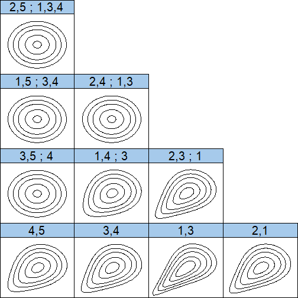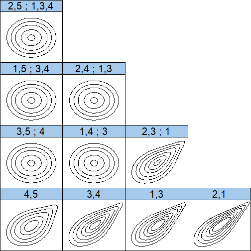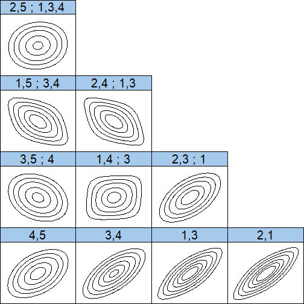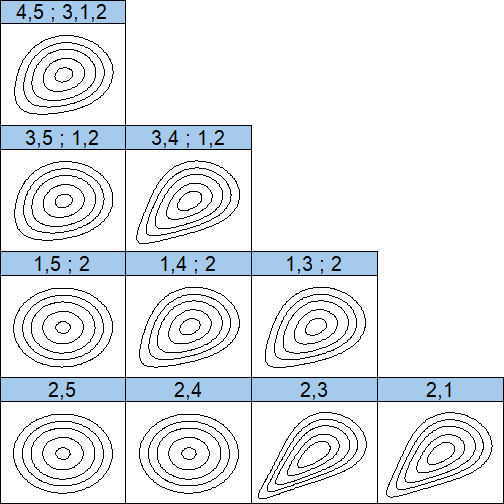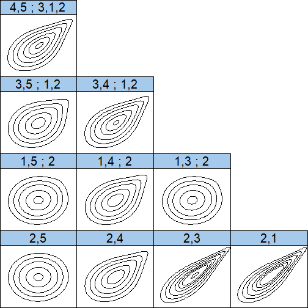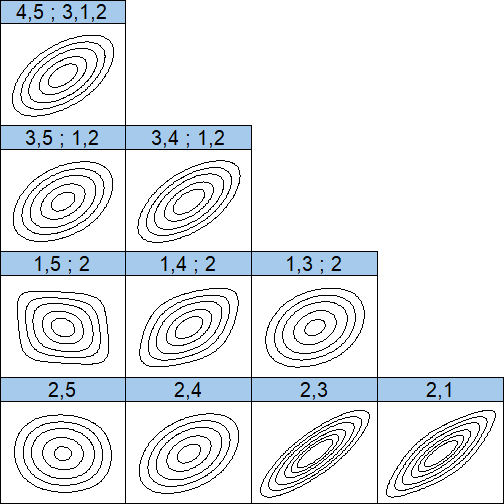

```
## [[1]]
## NULL
## 
## [[2]]
## NULL
## 
## [[3]]
## NULL
## 
## [[4]]
## NULL
## 
## [[5]]
## NULL
## 
## [[6]]
## NULL
```


```r
plot(cvineCla$RVM)
```

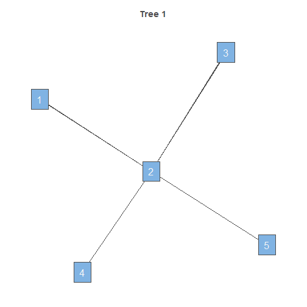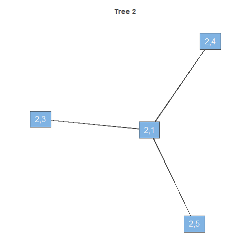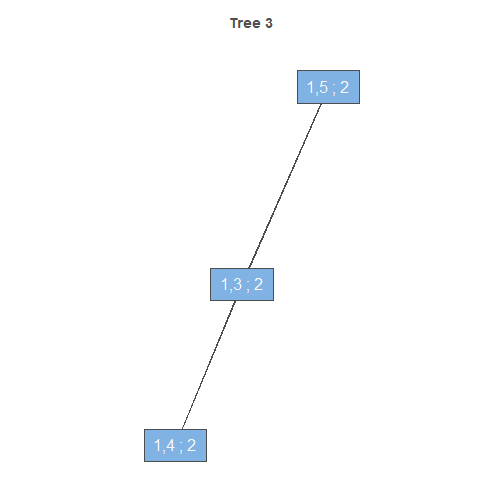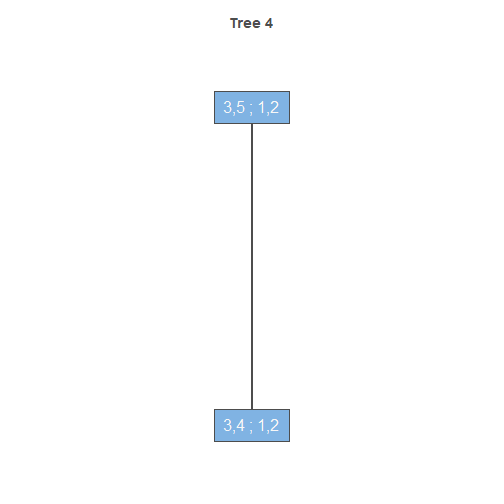


```r
plot(dvineCla$RVM)
```

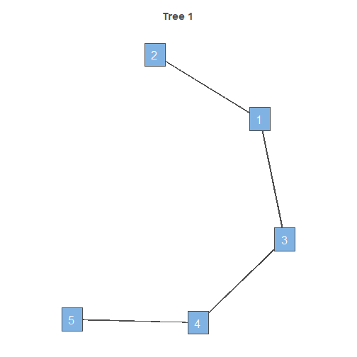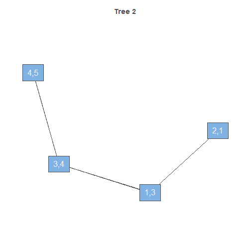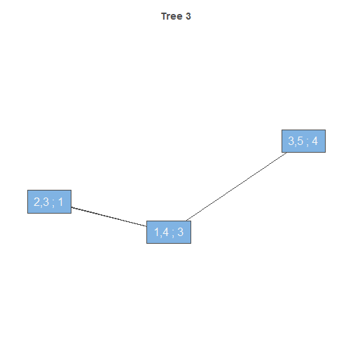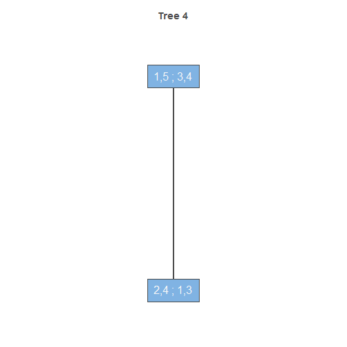


```r
digits <- 4
Rsummary(dvineGau$RVM, digits = digits)
```

```
## tree       edge | family  cop      par    par2 |     tau     utd     ltd 
## ------------------------------------------------------------------------ 
##    1        4,5 |      1    N   0.5024  0.0000 |  0.3351       -       -
##             3,4 |      1    N   0.6283  0.0000 |  0.4325       -       -
##             1,3 |      1    N   0.7298  0.0000 |  0.5208       -       -
##             2,1 |      1    N   0.7596  0.0000 |  0.5492       -       -
##    2      3,5;4 |      1    N  -0.2700  0.0000 | -0.1741       -       -
##           1,4;3 |      1    N   0.1708  0.0000 |  0.1093       -       -
##           2,3;1 |      1    N   0.6053  0.0000 |  0.4139       -       -
##    3    1,5;3,4 |      1    N  -0.3503  0.0000 | -0.2278       -       -
##         2,4;1,3 |      1    N  -0.4606  0.0000 | -0.3047       -       -
##    4  2,5;1,3,4 |      1    N   0.0028  0.0000 |  0.0018       -       -
## ---
## type: D-vine    logLik: 7978.23    AIC: -15936.46    BIC: -15871.8
```

```r
Rsummary(cvineGau$RVM, digits = digits)
```

```
## tree       edge | family  cop      par    par2 |     tau     utd     ltd 
## ------------------------------------------------------------------------ 
##    1        2,5 |      1    N  -0.0716  0.0000 | -0.0456       -       -
##             2,4 |      1    N   0.3653  0.0000 |  0.2381       -       -
##             2,3 |      1    N   0.8227  0.0000 |  0.6151       -       -
##             2,1 |      1    N   0.7596  0.0000 |  0.5492       -       -
##    2      1,5;2 |      1    N   0.0290  0.0000 |  0.0185       -       -
##           1,4;2 |      1    N   0.4498  0.0000 |  0.2970       -       -
##           1,3;2 |      1    N   0.2843  0.0000 |  0.1835       -       -
##    3    3,5;1,2 |      1    N   0.3479  0.0000 |  0.2262       -       -
##         3,4;1,2 |      1    N   0.5758  0.0000 |  0.3906       -       -
##    4  4,5;3,1,2 |      1    N   0.5515  0.0000 |  0.3719       -       -
## ---
## type: C-vine    logLik: 7975.82    AIC: -15931.63    BIC: -15866.98
```

```r
Rsummary(dvineCla$RVM, digits = digits)
```

```
## tree       edge | family  cop     par    par2 |    tau     utd     ltd 
## ---------------------------------------------------------------------- 
##    1        4,5 |      3    C  0.4707  0.0000 | 0.1905       -  0.2293
##             3,4 |      3    C  0.6345  0.0000 | 0.2409       -  0.3354
##             1,3 |      3    C  1.1720  0.0000 | 0.3695       -  0.5535
##             2,1 |      3    C  0.7542  0.0000 | 0.2738       -  0.3989
##    2      3,5;4 |      3    C  0.0001  0.0000 | 0.0000       -       -
##           1,4;3 |      3    C  0.3185  0.0000 | 0.1374       -  0.1134
##           2,3;1 |      3    C  0.6880  0.0000 | 0.2559       -  0.3651
##    3    1,5;3,4 |      3    C  0.0001  0.0000 | 0.0000       -       -
##         2,4;1,3 |      3    C  0.0001  0.0000 | 0.0000       -       -
##    4  2,5;1,3,4 |      3    C  0.0001  0.0000 | 0.0000       -       -
## ---
## type: D-vine    logLik: 3523.56    AIC: -7027.12    BIC: -6962.47
```

```r
Rsummary(dvineGu$RVM, digits = digits)
```

```
## tree       edge | family  cop     par    par2 |    tau     utd     ltd 
## ---------------------------------------------------------------------- 
##    1        4,5 |      4    G  1.4316  0.0000 | 0.3015  0.3772       -
##             3,4 |      4    G  1.9065  0.0000 | 0.4755  0.5615       -
##             1,3 |      4    G  2.0534  0.0000 | 0.5130  0.5985       -
##             2,1 |      4    G  2.3625  0.0000 | 0.5767  0.6590       -
##    2      3,5;4 |      4    G  1.0001  0.0000 | 0.0001  0.0001       -
##           1,4;3 |      4    G  1.0001  0.0000 | 0.0001  0.0001       -
##           2,3;1 |      4    G  1.7022  0.0000 | 0.4125  0.4974       -
##    3    1,5;3,4 |      4    G  1.0001  0.0000 | 0.0001  0.0001       -
##         2,4;1,3 |      4    G  1.0001  0.0000 | 0.0001  0.0001       -
##    4  2,5;1,3,4 |      4    G  1.0001  0.0000 | 0.0001  0.0001       -
## ---
## type: D-vine    logLik: 7819.56    AIC: -15619.13    BIC: -15554.47
```

```r
Rsummary(dvinet$RVM, digits = digits)
```

```
## tree       edge | family  cop      par     par2 |     tau     utd     ltd 
## ------------------------------------------------------------------------- 
##    1        4,5 |      2    t   0.4562  30.0000 |  0.3016  0.0019  0.0019
##             3,4 |      2    t   0.6580  30.0000 |  0.4572  0.0168  0.0168
##             1,3 |      2    t   0.7412  11.3791 |  0.5315  0.1992  0.1992
##             2,1 |      2    t   0.7785  10.5604 |  0.5681  0.2542  0.2542
##    2      3,5;4 |      2    t  -0.2579  30.0000 | -0.1661  0.0000  0.0000
##           1,4;3 |      2    t   0.1114   4.4758 |  0.0711  0.0858  0.0858
##           2,3;1 |      2    t   0.5552  30.0000 |  0.3747  0.0056  0.0056
##    3    1,5;3,4 |      2    t  -0.4413   5.8582 | -0.2910  0.0042  0.0042
##         2,4;1,3 |      2    t  -0.4416   4.7325 | -0.2912  0.0093  0.0093
##    4  2,5;1,3,4 |      2    t   0.0723  30.0000 |  0.0461  0.0000  0.0000
## ---
## type: D-vine    logLik: 8276.84    AIC: -16513.67    BIC: -16384.36
```

```r
Rsummary(cvineCla$RVM, digits = digits)
```

```
## tree       edge | family  cop     par    par2 |    tau     utd     ltd 
## ---------------------------------------------------------------------- 
##    1        2,5 |      3    C  0.0001  0.0000 | 0.0000       -       -
##             2,4 |      3    C  0.0001  0.0000 | 0.0000       -       -
##             2,3 |      3    C  1.1425  0.0000 | 0.3636       -  0.5451
##             2,1 |      3    C  0.8758  0.0000 | 0.3045       -  0.4532
##    2      1,5;2 |      3    C  0.0170  0.0000 | 0.0084       -  0.0000
##           1,4;2 |      3    C  0.4396  0.0000 | 0.1802       -  0.2066
##           1,3;2 |      3    C  0.4878  0.0000 | 0.1961       -  0.2415
##    3    3,5;1,2 |      3    C  0.2119  0.0000 | 0.0958       -  0.0379
##         3,4;1,2 |      3    C  0.7000  0.0000 | 0.2592       -  0.3715
##    4  4,5;3,1,2 |      3    C  0.2720  0.0000 | 0.1197       -  0.0782
## ---
## type: C-vine    logLik: 3904.05    AIC: -7788.11    BIC: -7723.45
```

```r
Rsummary(cvineGu$RVM, digits = digits)
```

```
## tree       edge | family  cop     par    par2 |    tau     utd     ltd 
## ---------------------------------------------------------------------- 
##    1        2,5 |      4    G  1.0150  0.0000 | 0.0147  0.0203       -
##             2,4 |      4    G  1.4683  0.0000 | 0.3189  0.3967       -
##             2,3 |      4    G  2.6532  0.0000 | 0.6231  0.7014       -
##             2,1 |      4    G  2.5175  0.0000 | 0.6028  0.6830       -
##    2      1,5;2 |      4    G  1.0404  0.0000 | 0.0388  0.0531       -
##           1,4;2 |      4    G  1.3805  0.0000 | 0.2756  0.3478       -
##           1,3;2 |      4    G  1.0478  0.0000 | 0.0456  0.0622       -
##    3    3,5;1,2 |      4    G  1.2659  0.0000 | 0.2101  0.2710       -
##         3,4;1,2 |      4    G  1.6245  0.0000 | 0.3844  0.4678       -
##    4  4,5;3,1,2 |      4    G  1.6722  0.0000 | 0.4020  0.4864       -
## ---
## type: C-vine    logLik: 8922.63    AIC: -17825.26    BIC: -17760.6
```

```r
Rsummary(cvinet$RVM, digits = digits)
```

```
## tree       edge | family  cop      par     par2 |     tau     utd     ltd 
## ------------------------------------------------------------------------- 
##    1        2,5 |      2    t  -0.0426  17.8883 | -0.0271  0.0002  0.0002
##             2,4 |      2    t   0.3984  30.0000 |  0.2608  0.0010  0.0010
##             2,3 |      2    t   0.8237  30.0000 |  0.6162  0.0934  0.0934
##             2,1 |      2    t   0.7812   7.7637 |  0.5708  0.3273  0.3273
##    2      1,5;2 |      2    t  -0.1463   3.9701 | -0.0935  0.0495  0.0495
##           1,4;2 |      2    t   0.4383   7.0420 |  0.2888  0.1141  0.1141
##           1,3;2 |      2    t   0.3009  30.0000 |  0.1946  0.0003  0.0003
##    3    3,5;1,2 |      2    t   0.4025  30.0000 |  0.2637  0.0010  0.0010
##         3,4;1,2 |      2    t   0.5855  30.0000 |  0.3982  0.0078  0.0078
##    4  4,5;3,1,2 |      2    t   0.5386  30.0000 |  0.3621  0.0047  0.0047
## ---
## type: C-vine    logLik: 8250.45    AIC: -16460.91    BIC: -16331.6
```


